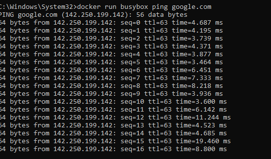
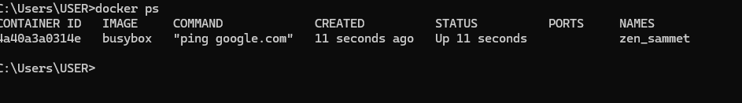
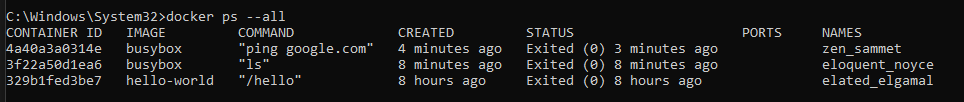
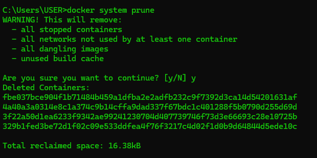
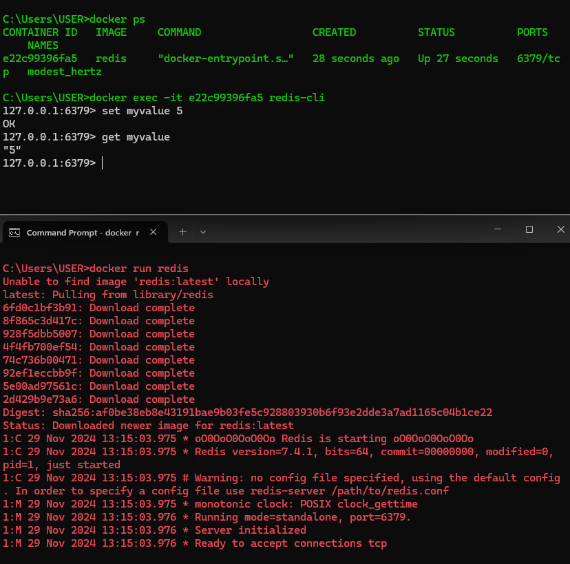

## Container

### How to run a container?
- `docker run [image-name]`

### How to override default run command?

- docker run [image-name] [command]
- e.g 1 `docker run busybox echo bye there`
- e.g 2 `docker run busybox ls`
- e.g 3 `docker run hello-world ls` (does not work because ls command executable is not found within the image)

### How to get list of running containers

- `docker ps`
- e.g for testing we need to run a container. (`docker run busybox ping google.com`)

### How to get lis of all containers ever created?
- `docker ps --all`

### To restart a container

- `docker start [container id]`

### Remove all containers

- `docker system prune`

### Get logs from the container without the `-a` flag

- `-a` flag requires us to start the container but if we want to not start the container but only log the output from the container
- `docker logs [container id]`

### How to stop running container

- `docker stop [container id]` sends SIGTERM signal to stop the container. It gives the container time to shut down and allows to perform cleanup
- `docker kill [container id]` sends SIGKILL signal to stop the container right now

### Execute multiple commands in a container
- `docker exec -it [container id] [command]`
- `-it` allows to give input
- e.g run redis image on different terminal
then run `docker exec -it e22c99396fa5 redis-cli` on different terminal to execute command on the running container

### Purpose of -it flag

- `-it` is shorthand for `-i -t`
- `-i` used for connecting input channel of container to our terminal
- `-t` makes sure output comes out in a prettier format
- It has 3 channels connected to it
- STDIN - to take input
- STDOUT - to get output
- STDERR - to give error

### How to get terminal acess inside the running container

- `docker exec -it e22c99396fa5 sh`
- `sh` allows to run powershell inside container

new line