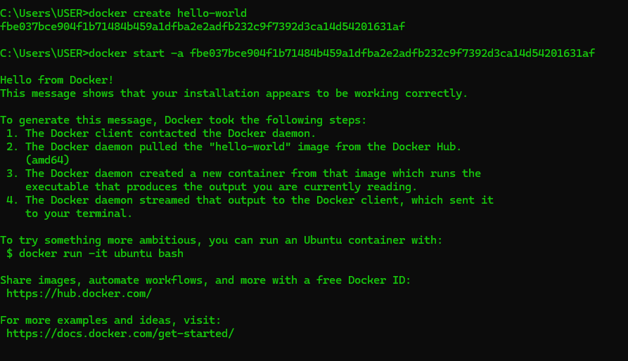

# Docker

## Introduction

### Why we need it?

- when we install any program, we run into an error we try to fix it then we run into another error. Docker solves this problem
- We dont have to go through setup and dependency issues

### What is Docker?
- It is a containerization platform

### What is a container?

### What is an image?
- docker hub downloaded an docker image which gets stored in my hdd which is used to create a container. 
- Image is a single file with all the dependencies and config info required to run the software.

### Docker Client?
- Tool we use to write commands

### Docker Server?
- Tool responsible for creating images, running containers etc

### Internal working

- Hardrive segmentation aka Namespacing used for isolating resources per process
- Control groups used to limit or control the amount of resources used per process

### Container lifecyle

- `docker run [image-name]` creates and run the container
- `docker run` = `docker create` + `docker start`

- `docker start` starts the container but doesnt echo the output from the container
- `-a` outputs all the output from the container to my terminal

### Container isolation
